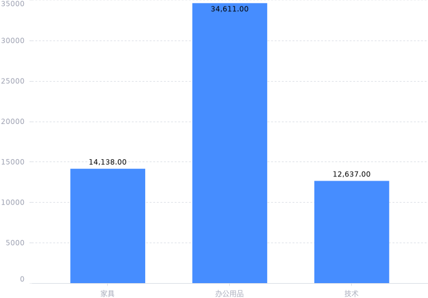

# Chart Advisor

## How to use

```
chartAdvisor(originDataset: DataItem[], dimensionList:Field[], measureList:Field[], aliasMap: AliasMap)
```

Enter the dataset and the information about the dimension and indicator fields, it returns the current recommended chart type and field allocation.

## Example

```
const dataset=[{ "210816110721021": "Furniture", "210816110721021": "14138" }, { "210816110721021": "Office supplies", "210816110721021": "34611" }, { "210816110721021": "Technology", "210816110721021": "12637" }]

const dimensionList=[{ "uniqueId": 210816110721021, "type": "textual" }]

const measureList=[{ "uniqueId": 210816110721022, "type": "numerical" }]

const aliasMap={ "210816110721021": "Category", "210816110721022": "Number" }

const result = advisor.calAdvisedChart(dataset, dimensionList, measureList, aliasMap)

console.log(result)
```

The output of the above code is:

```
{
chartType: 'column',
cell: [
{
x: ['210816110721021'],
y: ['210816110721022'],
row: [],
column: [],
color: [],
size: [],
angle: []
}
],
colorItems: [],
dataset: [[[[{"210816110721021":"Furniture","210816110721022":"14138"},{"210816110721021":"Office supplies","210816110721022":"34611"},{"210816110721021":"Technology","210816110721022":"12637"}]]]],
aliasMap: { '210816110721021': 'Category', '210816110721022': 'Number' }
}
```

The above data can be used directly to generate vizData.

The final generated chart is:



## Parameter explanation:

originDataset: The original data set, which is a list, each element is a DataItem, representing a row of data, the format is {uniqueID1: value1, uniqueID2: value2, ...}, where uniqueID is the id of the field, value is the value of this row data in that field.

```
type DataItem = {
[key: number]: string
}
```

dimensionList: Collection of dimension information, which is a list, each element is a Field.
measureList: The collection of indicator information, which is list, each element is a Field.

```
type Field={
uniqueId: number; //id of the field
type: string; //type of the field (number, string, date)
}
```

alisMap: Field alias table, consistent with the aliasMap in vizData.

```
type AliasMap = {
[key: number]: string;
};
```

## Return value:

Returns AdviseResult. The currently supported chart types are listed in ChartType.

```
type AdviseResult={
chartType: ChartType; //chartType in vizData
cell:Cell; //cell in vizData,
colorItems:[] //colorItems in vizData
dataset: DataItem[]; //The processed dataset used to generate vizData
aliasMap: AliasMap; //The processed field alias table used to generate vizData
}
```

Explanation of each type:

```
enum ChartType {
/** Table */
TABLE = 'table',

/** Bar chart */
COLUMN = 'column',
/** Percentage Bar chart */
COLUMN_PERCENT = 'column_percent',
/** Parallel Bar chart */
COLUMN_PARALLEL = 'column_parallel',

/** Line chart */
LINE = 'line',

/** Pie chart */
PIE = 'pie',

/** Scatter plot */
SCATTER = 'scatter',

/** Combined Bar chart */
COMBINECOLUMN = 'combineColumn', //combined chart composed of multiple bar charts

/** Combined z line chart */
COMBINELINE = 'combineLine', //combined chart composed of multiple line charts

/** Measure card */
MEASURE_CARD = 'measure_card',

/** Word cloud */
WORD_CLOUD = 'word_cloud',
}

interface Cell {
column?: UniqueId[];
row?: UniqueId[];
x?: UniqueId[];
y?: UniqueId[];
group?: UniqueId[];
color?: UniqueId[];
size?: UniqueId[];
shape?: UniqueId[];
angle?: UniqueId[];
radius?: UniqueId[];
text?: UniqueId[];
value?: UniqueId[];
tooltip?: UniqueId[];

// Dimension expansion information (Cartesian product)
cartesianInfo?: CartesianInfo;
// Indicator expansion information (Indicator flattening)
foldInfo?: FoldInfo;
}
```
